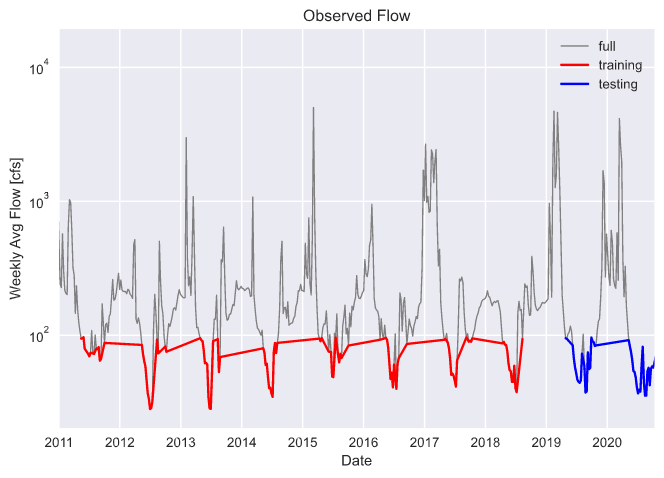
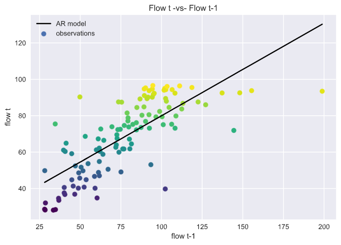
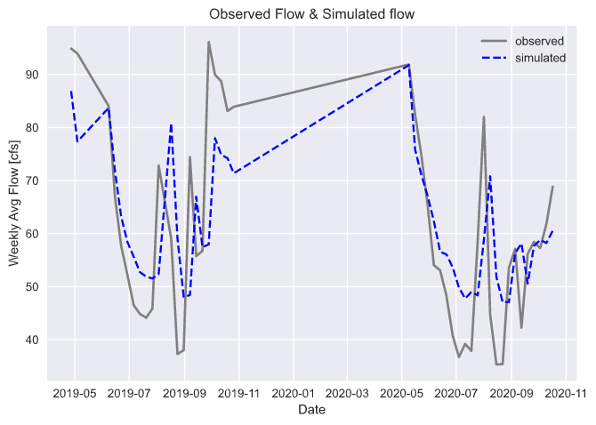

## Assignment 8: Forecast #8, Code Submission #1
**Name: Alcely Lau**

**Date: 10/19/2020**

#### Grade 
 - 6/6  Great  job!
 - Readability: 3
 - Style: 3 
 - Code: 3

 - Really excellent job with the comments!
 - Great job separating out all of the things that could be defined as variables. 

___
#### Table of Contents:

  - [ Question 1](#q1)
  - [ Question 2](#q2)
  - [ Question 3](#q3)
  - [ Question 4](#q4)

____

#### Assignment questions
Using data until 10/17/2020.

____

1. A brief summary of the AR model you built and why. Use whatever graphs you find helpful.

  **Response:**  
  - Criteria for selecting the AR model's variables:
    - weekly flow starting from Sunday to Saturday.
    - weekly flow with one shift.
    - only consider weekly flow <= 98 [cfs]. Using this condition the model is limited to flows equal to or lower than 98 [cfs], which takes into account the extremely low flows observed during the present year.
    - Testing and training periods:
         - training (red line on the graph): from 2010 to 2018, inclusive.
         - testing (blue line on the graph): from 2019 to the present day.

    
  - Model equation:

    `y(initial_flow) = 29.06 + 0.51 * initial_flow`,  `R^2 = 0.57`.

    The **Flow t -vs- Flow t-1** graph shows with the black line the linear equation or Autoregressive Model, generated with the flow t <= 98 [cfs]. It may be a quite good model for a flow range between 40 to 98 [cfs].

    

____

2. An explanation of how you generated your forecasts and why (i.e. did you  use  your AR model or not?)

  **Response:**

  For the forecast I applied the historical flow data for the interested weeks, multiplied by a correction factor.

  `week_forecast = week_data.quantile(0.6)*0.54`

  I don't use AR model. The AR model perfomance during the last weeks has not be good enough. In the **Observed Flow & Simulated Flow**, we can observe that for the last weeks the observations are above the simulations. The observed tendency is upward, but the simulated is downward.

  

____

3. A brief summary of what you got out of the peer evaluation. How did you make your script better?

  **Response:**
In the code review I obtained a general score of 3. However, the code reviewer stated that the code was long but the reason is that the code is well-commented. The reviewer pointed that in the code were some unnecessary printing lines. Hence, to improve the code I clean some printing lines that I wrote just to check that everything was working good. In addition, I created a new function for not repeating the same code for the 16 weeks forecast.
____

4. Describe the part of your script that you are most proud of and why.

  **Response:**
  Lines 67 to 101, where it is defined the `brainmodel` because is capable of doing a repetitive task and the inputs can be changed easily. Moreover, this part of the code summarizes almost all the seen lessons: function, loop, condition, list and dataframe.
