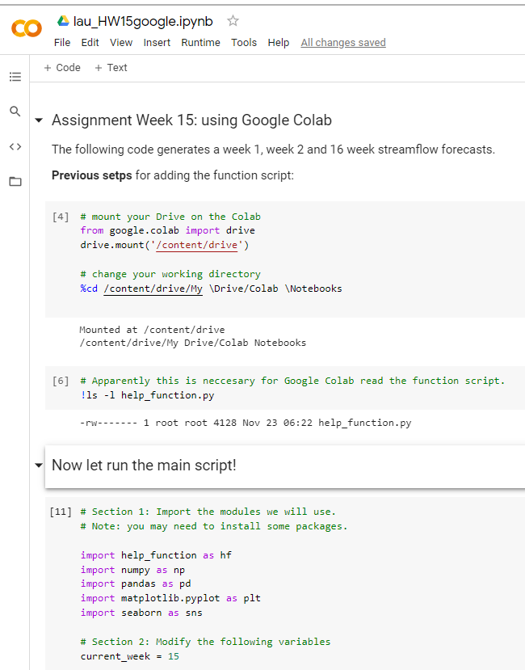

## Assignment 15: Computing resources
**Name: Alcely Lau**

**Date: 12/07/2020**
___
#### Table of Contents:
1. [ Forecast summary](#forecast)
1. [ Assignment questions](#assignment)
  - [ Question 1](#q1)
  - [ Question 2](#q2)
  - [ Question 3](#q3)
  - [ Question 4](#q4)

___

#### Forecast summary
 For the forecast I applied the historical flow data for the interested weeks, multiplied by a correction factor.
____

#### Assignment questions

1. **What resources did you request on Ocelote? How long did you wait in the queue for your job to run and how long did it take to run?**
- The requested resources were: 1 node, 1 core, 6gb of memory total, for 5 minutes of CPU time.
- I had to wait in a range between nothing and less than 1 minute in the queue.
- It takes 13 seconds to run in Ocelote.

2. **What was the most confusing part to you about setting up and running your job on Ocelote?**
In my opinion, the most confusing step was writing the submission request `run.pbs`.
- In the first try, I used the generated script from the job builder tool: <https://jobbuilder.hpc.arizona.edu/> and add the process lines. However, for some reason my request was reject.
- In the second  try, I modified the starter code. The job was executed but the process failed because it didn't find the file directory.
- After several hours, in the **n-try**, I was sure the something was wrong with the file directory so I typed it myself (no copy & paste). Finally, it works!! My mistake was a capital letter that wasn't in my name directory.

3. **Where else did you run your job? How did the setup compare to your run on Ocelote?**
- I also ran it in Google Colab. After my experience with Ocelote, it was surprisingly easy to follow.
- The most difficult part was how to connect Google Collab to my Drive, were I have a function script that I needed to import in my script.

4. **What questions do you still have after doing this?**
- In Ocelote, where is the proper location to save the `run.pbs` file?
- Google Colab is too easy to be true, what are the disadvantages in comparison with Ocelote?
- In case that a job will take more than the possible requested cputime. What are good coding practices that can we follow in order to the script doesn't start running from the beginning?
