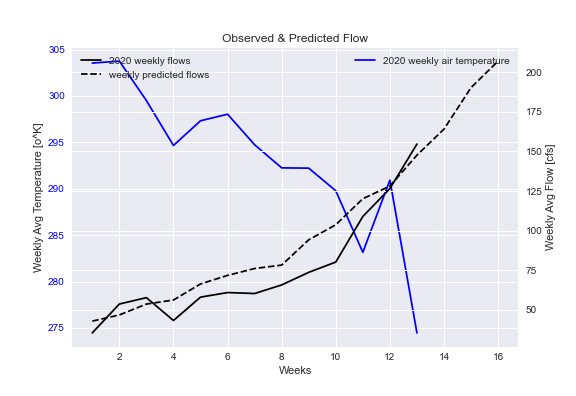
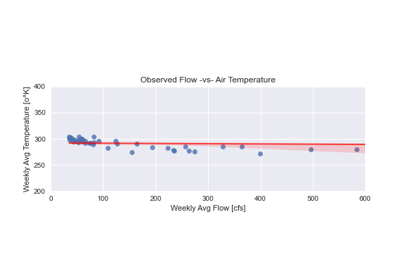
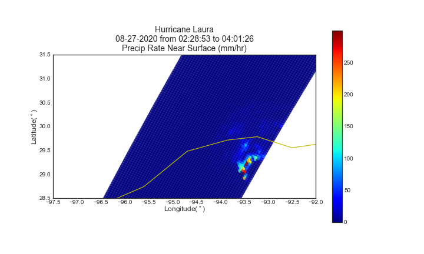
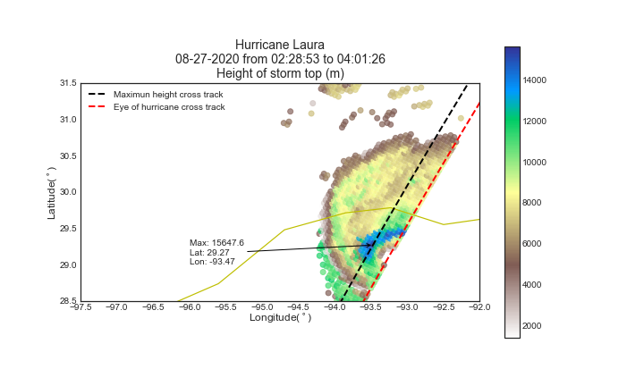
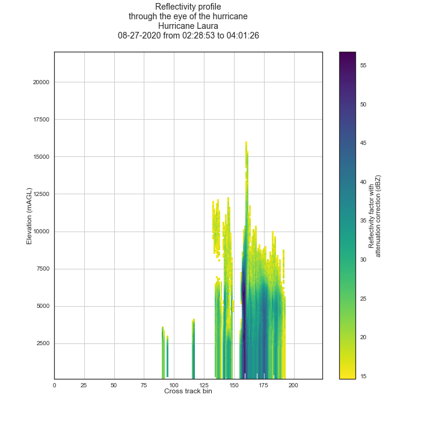

## Assignment 12: Forecast #12, Hierarchical Data
**Name: Alcely Lau**

**Date: 11/16/2020**
___
#### Table of Contents:
1. [ Forecast summary](#forecast)
1. [ Assignment questions](#assignment)
  - [ Dataset description](#q1)
  - [ Additional timeseries plots](#q2)
  - [ Plot of Hurricane Laura](#q3)
___

#### Forecast summary
For the forecast I applied a regression model created using the observed flow with 1 to 8 shifts and the observed air temperature at 2 meters above the surface for the training period from August to November 2020, multiplied by a correction factor.
____

#### Assignment questions

2. A description of the dataset you added
  - **What is the dataset? Why did you choose it?**

    The dataset is the daily average of `air temperature at 2 meters above the surface` from NCEP re-analysis. I choose it because the air temperature shows a proportional inversed relation with the flow.

  - **What is the spatial and temporal resolution and extent of the data?**
    - Spatial: Global, 2.5deg by 2.5deg.
    - Temporal: daily

  - **Where did you get the data from?**

    The data is downloaded from the NOAA: Physical Sciences Lab.

  - **What was your approach to extracting and aggregating it into something useful to you?**

    1. Go to [search page](https://psl.noaa.gov/cgi-bin/db_search/SearchMenus.pl).
    2. select `NCEP Reanalysis Daily Averages` and `Air temperature`.
    3. Click `make a subset` and input the spatial region and time period you are interested in. Then, click `create subset` and when you get to the page with the graph select `FTP the data` and finally select `FTP a copy of the data`.
    4. In Python open the netCDF file using `xarray` package.
    5. Check the organization of the dataset by calling the interested variables.
    6. Transform the `Dataset` to `Dataframe`.
    7. Continue working as usual.

3. **A plot of the dataset you added. This can be a timeseries, map, histogram or any other plot that you think is a good summary of what you added.**

Line plot: Shows the observed air temperature, the observed flow and the predicted flow for the 16 weeks.

Scatter plot: Shows the observed air temperature -vs- the observed flow to visualize its dispersion.

4. **A special plot for the NetCDF gallery**

The datasets are from the Dual-frequency Precipitation Radar (DPR) onboard GPM spacecraft, during Hurricane Laura on 08-27-2020 for the period between 02:28 to 4:01 UTC.
- Precipitation Rate near surface (mm/hr).
- Height of storm top (m).
- Reflectivity profile (dBZ), looking the vertical development of the hurricane

For more information open the script `GPM_DPR.py` or go [here](https://docs.google.com/presentation/d/1aczDtIH-v7jttA3_CvKQBSiWCfeEyV6LnpbiYbzzPaY/edit?usp=sharing).

