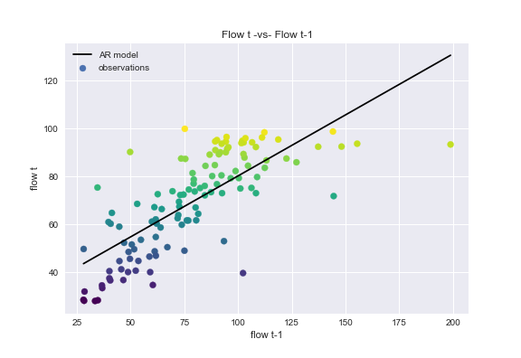
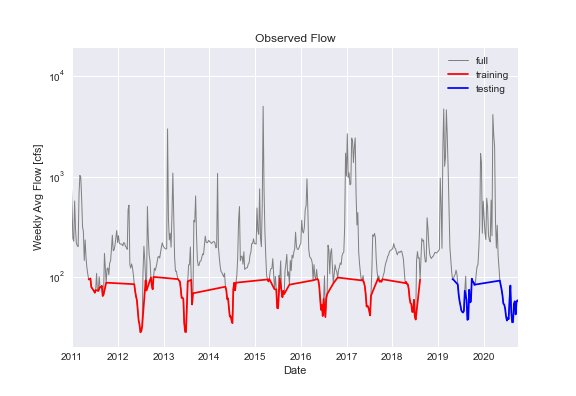
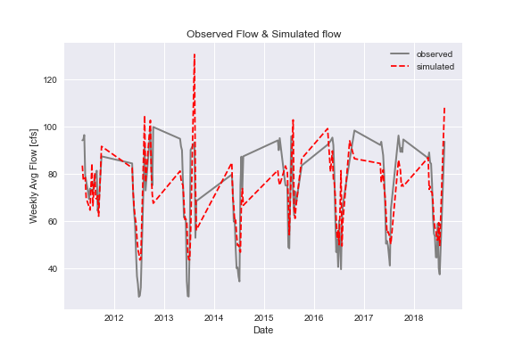
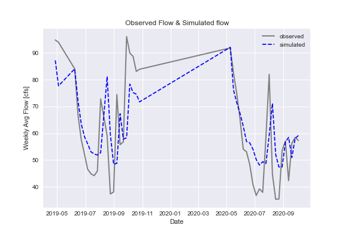

## Assignment 6: Forecast #6, Autoregressive Model & Matplotlib
**Name: Alcely Lau**

**Date: 10/04/2020**
___
#### Table of Contents:
1. [ Forecast summary](#forecast)
1. [ Assignment questions](#assignment)
  - [ Question 1](#q1)
  - [ Question 2](#q2)
  - [ Question 3](#q3)
___

#### Forecast summary
This river makes me worry about its extremely low flows.

For this week I followed the next steps:

1. Download the stream gauge observations from the USGS NWIS website, [mapper](https://maps.waterdata.usgs.gov/mapper/) and download the daily streamflow data using the following parameters:
  - Station  09506000 Verde River Near Camp Verde
  - Daily Data
  - Parameter 00060 Discharge (mean)
  - Start date = 1989-01-01
  - End date = Today
  - Select 'tab separated'

2. Explore the data using **Pandas DataFrames**. First, checking the streamflow registered in the last 3 weeks, the last 2 weeks and the last week. Then, I applied the AR model as it is described in the next section.
____

#### Assignment questions
Using data until 10/03/2020.

1. A summary of the AR model that you ended up building, including (1) what you are using as your prediction variables, (2) the final equation for your model and (3) what you used as  your testing and training periods. In your discussion please include graphical outputs that support why you made the decisions you did with your model.

  **Response:**  
  1. Criteria for selecting my prediction variables:
    - weekly flow starting from Sunday to Saturday.
    - weekly flow with one shift.
    - only consider weekly flow <= 100 [cfs]. Using this condition the model is limited to flows equal to or lower than 100 [cfs], which takes into account the extremely low flows observed during the present year (see the **Observed flow** graph).
  2. Model equation:
    - General form:

        *y(last_week_flow) = model.intercept_ + model.coef_ * last_week_flow*
    - Particular form:

        *y(last_week_flow) = 29.65 + 0.51 * last_week_flow*

        *R^2 = 0.57*

        The **Flow t -vs- Flow t-1** graph shows with the black line the linear equation or Autoregressive Model, generated with the flow t <= 100 [cfs]. It may be a quite good model for a flow range between 40 to 100 [cfs].
        

  3. Testing and training periods:
      - training (red line on the graph): from 2010 to 2018, inclusive.
      - testing (blue line on the graph): from 2019 to the present day.
        

2. Provide an analysis of your final model performance. This should include at least one graph that shows the historical vs predicted streamflow and some discussion of qualitatively how you think your model is good or bad.

  **Response:**

  The **Observed Flow & Simulated Flow** top graph represents the observations of the training data and the simulations for the same data. The **Observed Flow & Simulated Flow** bottom graph represents the observations of the testing data and the simulations for the same data. In both cases the model is not overfitted, it may show some signs of underfitting. However, this flexibility could be good for an unprecedented year as 2020.

  On the other hand, a correlation coefficient R^2 equal to 0.57 is quite good for a flow range between 40 to 100 [cfs]. In the **Observed Flow & Simulated Flow** bottom graph, we can observe that for the last weeks the observations and simulations are almost overlapped.
    
    

3. Finally, provide discussion on what you actually used for your forecast. Did you use your AR model, why or why not? If not how did you generate your forecast this week?

  **Response:**
The truth is that for forecast #6 I decided to use the AR model to try a different method than just the mean of some years. Nonetheless, the mean method was giving forecast closed to the real observations but always with a higher value than the observation. So, wish me luck!
