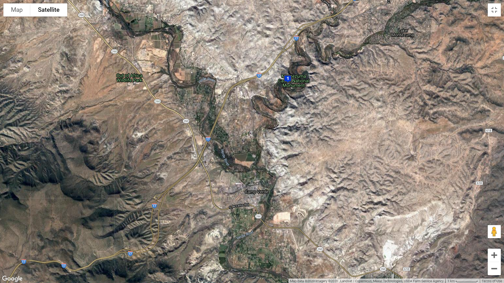
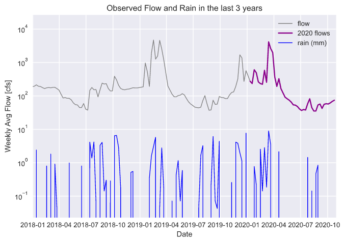

## Assignment 9: Forecast #9, Reading API data
**Name: Alcely Lau**

**Date: 10/26/2020**

___
#### Table of Contents:
1. [ Forecast summary](#forecast)
1. [ Assignment questions](#assignment)
  - [ Dataset description](#q1)
  - [ Additional timeseries plot](#q2)
___

#### Forecast summary
This river makes me worry about its extremely low flows.

For this week I followed the next steps:

1. Download the stream gauge observations directly from USGS NWIS website to python, [mapper](https://maps.waterdata.usgs.gov/mapper/) using the following parameters:
  - Station  09506000 Verde River Near Camp Verde
  - Daily Data
  - Parameter 00060 Discharge (mean)
  - Start date = 1989-01-01
  - End date = Today
  - Select 'tab separated'

2.   For the forecast I applied the historical flow data for the interested weeks, multiplied by a correction factor.

  `week_forecast = week_data.quantile(0.6)*factor`
  
____

#### Assignment questions
Using data until 10/24/2020.

2. A description of the dataset you added
  - **What is the dataset? Why did you choose it?**

    The dataset is Global Historical Climatology Network - Daily (GHCN-Daily), Version 3 from NCDC (NOAA)'s Climate Data Online (CDO). I choose it because contains station-based measurements for meteorological parameters, such as: daily maximum and minimum temperature, temperature at the time of observation, precipitation, snowfall and snow depth.

    Also, each token is limited to five requests per second and 10,000 requests per day, no more of 1000 data per request.
    [More information>>](https://www.ncei.noaa.gov/metadata/geoportal/rest/metadata/item/gov.noaa.ncdc:C00861/html)

  - **What location have you chosen?**
    - Station name: MONTEZUMA CASTLE NM
    - Country: United States
    - State: Arizona
    - County: Yavapai
    - GHCN ID: USC00025635
    - Latitude: 34.616667
    - Longitude: -111.833333
    - [More information>>](https://www.ncdc.noaa.gov/homr/#ncdcstnid=20001191&tab=MSHR)
    

  - **Where did you get the data from?**

    The data is downloaded from the NOAA National Centers for Environmental Information (NCEI)'s Climate Data Online (CDO). [Web services dcoumentation>>](https://www.ncdc.noaa.gov/cdo-web/webservices/v2#gettingStarted)

  - **What was your approach to accessing it?**

    1. Read the Web Services Documentation.
    2. Sign up and request a token.
    3. Know the request limitations.
    4. Select the interested station.
    5. Code a for loop to make several requests (considering the limitations).
    6. Check the JSON file (`type()` and `keys()`).
    7. Create the timeseries dataframe.

3. **A plot of your additional time series along with your streamflow time series.**

  
